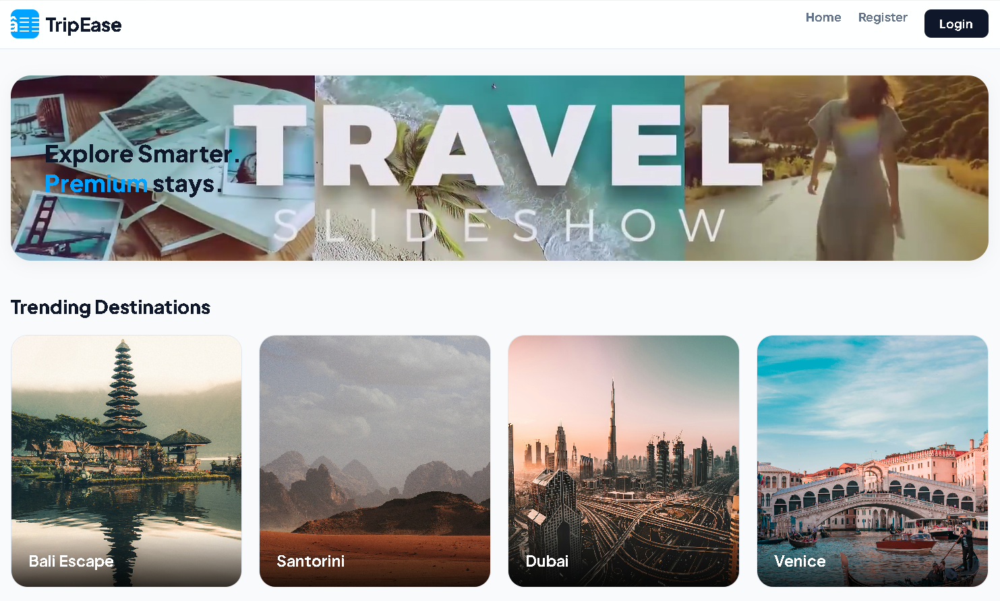
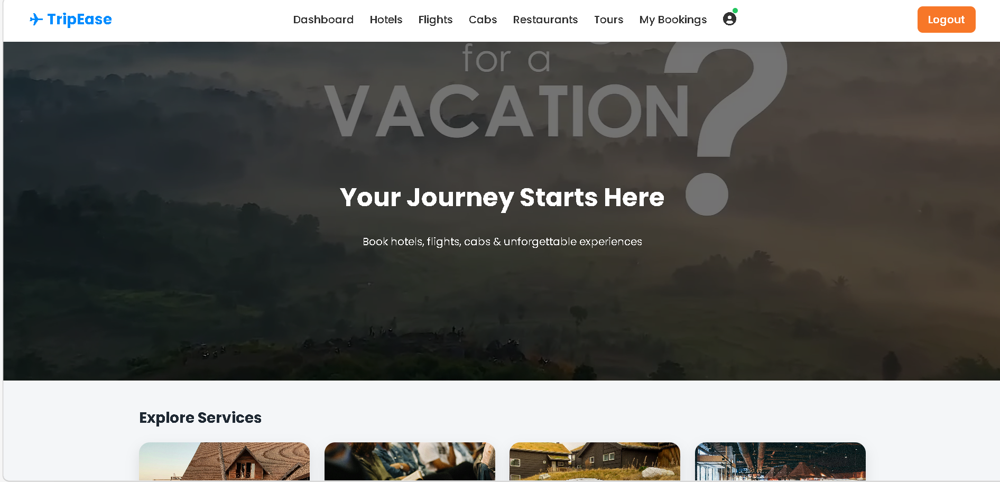
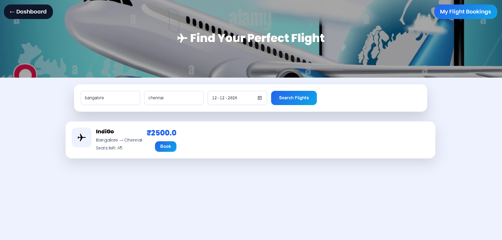
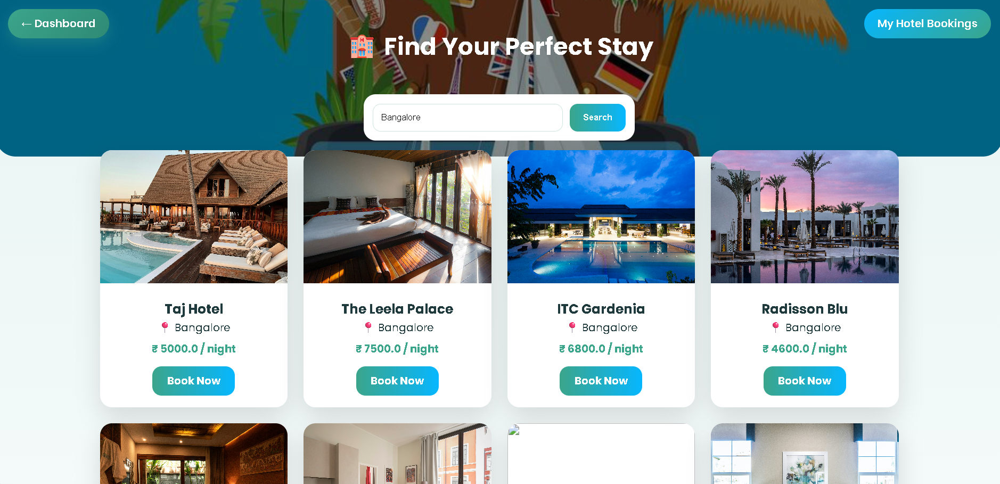
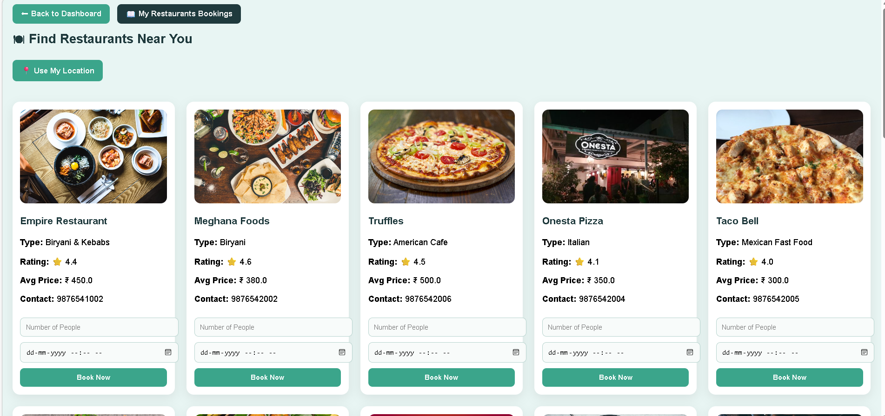
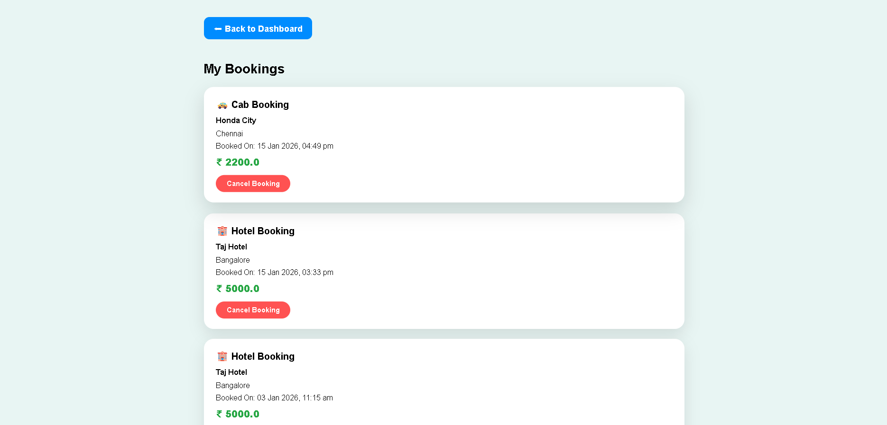
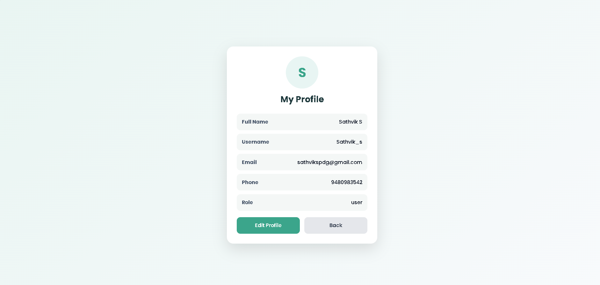
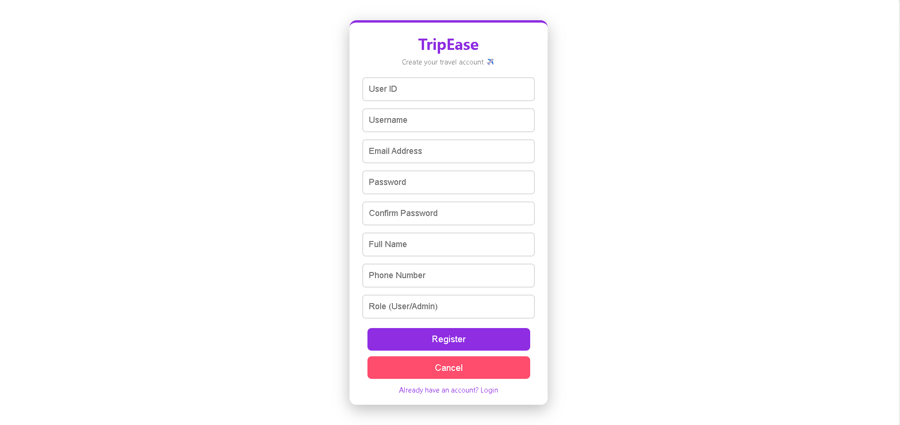

# TripEase ✈️🏨🚖 – Full Stack Travel Booking Web Application

TripEase is a full-stack Java travel booking web application integrating **flights, hotels, cabs, restaurants, famous places, and tour packages**.

## 🚀 Key Features
- Secure **Authentication** and **Session Management**
- MVC Architecture (**Servlets + JSP + JDBC + MySQL**)
- Responsive UI using **Bootstrap**
- Deployed on **Apache Tomcat**

## 🛠 Tech Stack
- Java, Servlets, JSP
- JDBC, MySQL
- HTML, CSS, Bootstrap
- Apache Tomcat

## 🧱 Project Structure (MVC)
- **Controller:** Servlets
- **View:** JSP Pages
- **Model:** JDBC + DAO Layer (MySQL)

## ⚙️ How to Run Locally
1. Clone the repo
```bash
git clone https://github.com/<your-username>/TripEase.git

## 📸 Screenshots

### Home


### Login


### Dashboard


### Flights


### Hotels


### Tours


### Restaurants


### Cabs


### My Booking


### Profile


### Register

